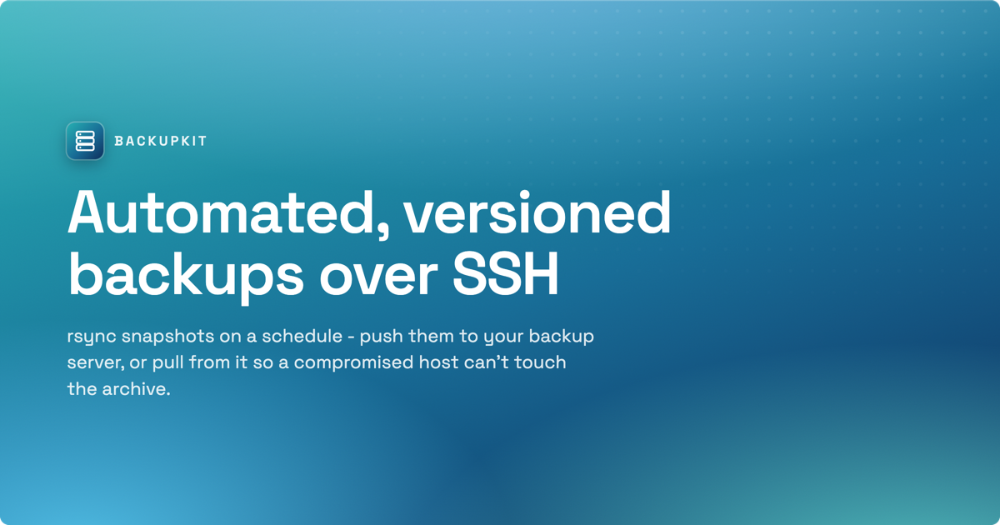

# @daanvandenbergh/backupkit



Automated, versioned backups over SSH - a thin, dependency-free TypeScript layer on top of `rsync`.

- **Versioned** - each run is a dated snapshot, unchanged files hard-linked against the previous one, so history costs almost nothing.
- **Push or pull** - the source host can push to the backup server, or the backup server can pull from the source. Pull is the safe default: a compromised source host holds no credentials to reach the archive.
- **Automated** - a scheduler runs each target on its own interval and prunes old snapshots on a GFS retention policy, under systemd or launchd.
- **Safe by construction** - snapshots are atomic (write to `<name>.partial`, rename on success), locked per destination, and only complete snapshots ever seed the next hard-link base. rsync and ssh are always spawned as argv arrays, never a shell string.

Full documentation: **https://daanvandenbergh.github.io/backupkit/**

## Install

```bash
npm install -g @daanvandenbergh/backupkit
```

Requires **rsync >= 3.2.5** and **ssh** on both hosts (macOS ships openrsync - `brew install rsync`). Node >= 20.

## Quick start

Three steps get a machine backing up:

```bash
backupkit init             # write a commented starter config.jsonc
backupkit check            # verify rsync/ssh versions, keys, and host reachability
backupkit service install  # register the daemon, then: backupkit service start
```

A minimal **pull** config (`/etc/backupkit/config.jsonc`) - the backup server fetches from a source host that holds no archive credentials:

```jsonc
{
    "remotes": {
        // A remote is either explicit (host/user/identityFile) or an ssh_config alias ({ "alias": "..." }).
        "web1": {
            "host": "10.0.0.11",
            "user": "backup-reader",
            "identityFile": "/etc/backupkit/keys/web1_ed25519"
        }
    },
    "targets": {
        "web1-www": {
            "direction": "pull",           // this host fetches from the remote
            "remote": "web1",
            "source": "/var/www",          // path on the remote
            "destination": "/srv/backups", // local archive root -> /srv/backups/web1-www/<snapshot>/
            "schedule": { "interval": "day", "intervalCount": 1, "at": "03:00" },
            "retention": { "keepDaily": 14, "keepWeekly": 8, "keepMonthly": 12 }
        }
    }
}
```

Then `backupkit run` performs one pass over every due target; the daemon does it on schedule.

## CLI

| Command | What it does |
|---|---|
| `backupkit init` | Write a commented starter `config.jsonc` at the resolved path. |
| `backupkit check` | Validate config; verify rsync/ssh versions on both ends, probe each host, pin host keys (on a TTY), print the recommended push-jail `authorized_keys` lines (informational - the jail is never probed). |
| `backupkit run [TARGET...]` | Back up due targets now (`--force` ignores the schedule, `--dry-run` transfers nothing). |
| `backupkit status [TARGET...]` | One row per target: last run, next due, consecutive failures, lock state (`--json`). |
| `backupkit list [TARGET...]` | Complete snapshots, oldest first (alias `ls`, `--json`). |
| `backupkit restore TARGET SNAP` | Copy a snapshot (`--snapshot latest`) to a fresh `--output` path; never overwrites, never deletes. |
| `backupkit prune [TARGET...]` | Apply retention now (`--dry-run` prints the keep/prune plan; `--force` overrides the planted-snapshot guard). |
| `backupkit service <verb>` | `install`/`uninstall`/`start`/`stop`/`restart`/`status` the systemd unit or launchd job. |
| `backupkit logs [-f] [-n N]` | Tail the daemon logs (journald on Linux, log files on macOS). |
| `backupkit daemon` | Foreground scheduler loop (what the installed service runs). |
| `backupkit jail install\|status` | Run **on an archive server** (config-free): atomically install/update the shipped `backupkit-remote` jail script at `/usr/local/bin/backupkit-remote`, or verify the installed copy matches this package version. |

`--config <path>` overrides the default lookup (`$BACKUPKIT_CONFIG`, then `/etc/backupkit/config.jsonc`, then `~/.backupkit/config.jsonc`). See the [configuration reference](https://daanvandenbergh.github.io/backupkit/configuration) and [CLI reference](https://daanvandenbergh.github.io/backupkit/cli-reference).

## Push vs pull

**Pull** (recommended) keeps every credential on the backup server: it reaches out and fetches, so a compromised source host holds nothing that can read or delete a stored snapshot. **Push** is for when the source cannot be reached inbound; by default the push key on the archive server is confined by a `backupkit-remote` forced command that jails it to one destination root, permits only rsync plus the snapshot lifecycle, pins each transfer's destination to the scratch `<snapshot>.partial` directory of the run, and validates a rename as a *pair* so a snapshot can never be renamed into a deletable name it did not already have - so no single command, and no pair of commands, can erase a target's archive history. `backupkit check` prints the exact `authorized_keys` line, and installing the script on the archive server is one command there: `npm install -g @daanvandenbergh/backupkit && sudo backupkit jail install` (rerun `jail install` after every package update; `backupkit jail status` tells you when the installed copy has fallen behind, and every `backupkit` command on that server warns on stderr while an installed copy is outdated). Installation is deliberately the server admin's local act - the push client never holds a credential that could rewrite the jail that confines it.

The jail is **recommended, not required**: set `"jail": false` on a push target to run without it - for a plain account whose risk you accept, or a restricted host (a storage-box style appliance) where a forced command cannot be installed. Transfers are identical either way: the client always speaks plain rsync plus POSIX file commands over ssh, and the jail only *filters* them, so nothing is installed on the happy path that the unjailed path lacks. What changes is authority: an unjailed push key can do whatever the account allows, including deleting the entire archive. Without the jail the account must accept these commands over ssh: `rsync --server`, `mkdir -p --`, `mkdir --`, `mv --`, `ls -A --`, `rm -rf --`, and `df -Pk --` - listing is the one command that differs by mode (a jailed target lists with the jail's `find <dir> -maxdepth 1 -mindepth 1 -print0`), because a restricted appliance shell often has no `find` at all. `backupkit check` never probes for the jail; it only prints the lines for jailed targets and notes each `"jail": false` one.

What the jail **cannot** prevent is the authority push mode inherently grants: the pushing host runs retention, so a compromised push client can retire completed snapshots one at a time exactly as the legitimate client does. The archive server holds no retention policy of its own and cannot tell a policy-driven prune from a targeted deletion. That is the structural reason pull is the recommendation, and it is why `backupkit prune` is the only bulk path.

What neither direction can prevent is a source that lies about its own contents: a compromised source can present an emptied tree, and count-based retention would eventually age out the snapshots holding the real data. Backupkit trips a content-collapse guard when a snapshot's file count collapses against the previous one - the snapshot is still stored, but retention is skipped and the run is logged at error level until you confirm the shrink is real with `backupkit prune`. See the [security model](https://daanvandenbergh.github.io/backupkit/security-model).

## Library API

The CLI is a thin shell over the `Backupkit` class, which you can drive directly:

```ts
import { Backupkit } from "@daanvandenbergh/backupkit";

const kit = Backupkit.fromConfig(); // or Backupkit.fromConfig("/etc/backupkit/config.jsonc")

await kit.check();                       // readiness: binaries, keys, hosts, jail lines
await kit.run();                         // one pass over every due target
await kit.start();                       // foreground scheduler loop (stop() ends it)

const rows = await kit.status();         // last run, next due, failures, lock state
const snaps = await kit.listSnapshots(); // complete snapshots, oldest first
await kit.prune({ dryRun: true });       // retention plan without deleting
await kit.restore({ target: "web1-www", snapshot: "latest", output: "/tmp/restored" });
```

## License

UNLICENSED.
